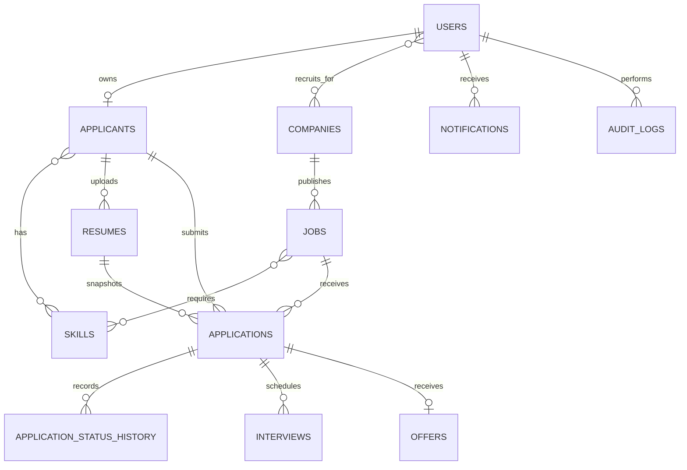

# Entity Relationship Diagram

```mermaid
erDiagram
  USERS ||--o| APPLICANTS : owns
  USERS }o--o{ COMPANIES : recruits_for
  COMPANIES ||--o{ JOBS : publishes
  JOBS }o--o{ SKILLS : requires
  APPLICANTS }o--o{ SKILLS : has
  APPLICANTS ||--o{ RESUMES : uploads
  APPLICANTS ||--o{ APPLICATIONS : submits
  JOBS ||--o{ APPLICATIONS : receives
  RESUMES ||--o{ APPLICATIONS : snapshots
  APPLICATIONS ||--o{ APPLICATION_STATUS_HISTORY : records
  APPLICATIONS ||--o{ INTERVIEWS : schedules
  APPLICATIONS ||--o| OFFERS : receives
  USERS ||--o{ NOTIFICATIONS : receives
  USERS ||--o{ AUDIT_LOGS : performs
```

Schema chi tiết sẽ được chốt cùng migration đầu tiên.
