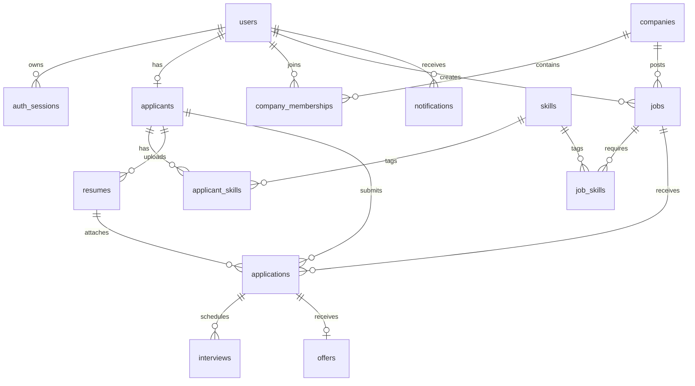

# Cơ sở dữ liệu Job Portal rút gọn

Phiên bản này dành cho mục tiêu học xây dựng API nghiệp vụ. Schema có **14 bảng**, đủ cho luồng đăng nhập, quản lý công ty, đăng job, ứng tuyển, phỏng vấn, offer, thông báo và gợi ý việc làm cơ bản.

## 1. Nguyên tắc tối ưu

- Giữ `company_memberships` vì một công ty có thể có nhiều recruiter.
- Gộp học vấn và kinh nghiệm vào JSONB của `applicants`.
- Lưu location/category trực tiếp trong `companies` và `jobs`.
- Chỉ lưu trạng thái hiện tại; chưa dùng bảng lịch sử riêng.
- AI đọc dữ liệu hiện có và gọi provider theo request, chưa cần bảng cache/rate-limit riêng.

## 2. Sơ đồ quan hệ

## 3. Danh sách 14 bảng

| Bảng | Mục đích | Trường chính |
|---|---|---|
| `users` | Tài khoản và vai trò | email, password_hash, full_name, role, status |
| `auth_sessions` | Refresh-token session | user_id, refresh_token_hash, expires_at, revoked_at |
| `companies` | Hồ sơ công ty | name, industry, location, verification_status, status |
| `company_memberships` | Recruiter thuộc công ty | company_id, user_id, membership_role |
| `applicants` | Hồ sơ ứng viên | user_id, headline, location, education JSONB, experience JSONB |
| `skills` | Danh mục kỹ năng | name |
| `applicant_skills` | Kỹ năng ứng viên | applicant_id, skill_id |
| `jobs` | Tin tuyển dụng | company_id, title, location, category, salary, deadline, status |
| `job_skills` | Kỹ năng job yêu cầu | job_id, skill_id |
| `resumes` | Metadata file CV | applicant_id, storage_key, mime_type, size_bytes |
| `applications` | Đơn ứng tuyển | job_id, applicant_id, resume_id, status, recruiter_note |
| `interviews` | Vòng phỏng vấn | application_id, round_number, scheduled_at, status, result |
| `offers` | Thư mời nhận việc | application_id, salary, deadline, status |
| `notifications` | Thông báo trong ứng dụng | user_id, title, body, resource_type, resource_id |

## 4. Quy tắc nghiệp vụ chính

- User có một role: `APPLICANT`, `RECRUITER` hoặc `ADMIN`.
- Một recruiter thuộc tối đa một công ty; một công ty có nhiều recruiter.
- Membership có role `OWNER` hoặc `MEMBER`.
- Chỉ company `VERIFIED` và `ACTIVE` được hiển thị công khai.
- Job có trạng thái `DRAFT`, `PUBLISHED` hoặc `CLOSED`.
- Một applicant chỉ được ứng tuyển một lần cho mỗi job.
- Application đi qua `APPLIED`, `INTERVIEW`, `OFFER`, `HIRED`, `REJECTED` hoặc `WITHDRAWN`.
- Mỗi application có nhiều interview nhưng chỉ có tối đa một offer trong bản học tập.

## 5. AI cơ bản không cần thêm bảng

- Recommendation: tính điểm dựa trên phần giao của `applicant_skills` và `job_skills`, cộng location và salary.
- Match explanation: API lấy hồ sơ/job, loại dữ liệu nhạy cảm rồi gọi LLM để giải thích.
- JD assistant: API nhận title, category, skills và sinh bản nháp description/requirements.
- Kết quả AI không tự thay đổi trạng thái tuyển dụng và luôn cần người dùng xác nhận trước khi lưu.

## 6. Stored functions

Các function company nằm trong `src/backend/sql/company.sql`:

- `list_public_companies()`
- `get_public_company(uuid)`
- `list_public_company_jobs(uuid)`

Sau khi áp dụng migration tạo bảng, chạy file SQL để cài/cập nhật function.
Database đã áp dụng phiên bản cũ có thể vẫn chứa `list_public_jobs()` và `get_public_job(uuid)`; reset source không thay đổi database đó.
