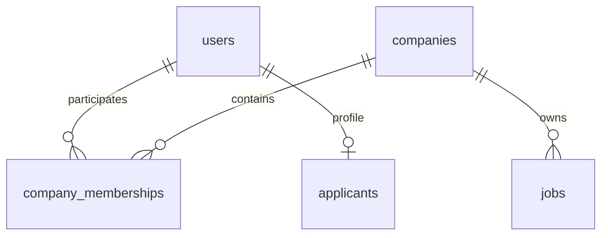
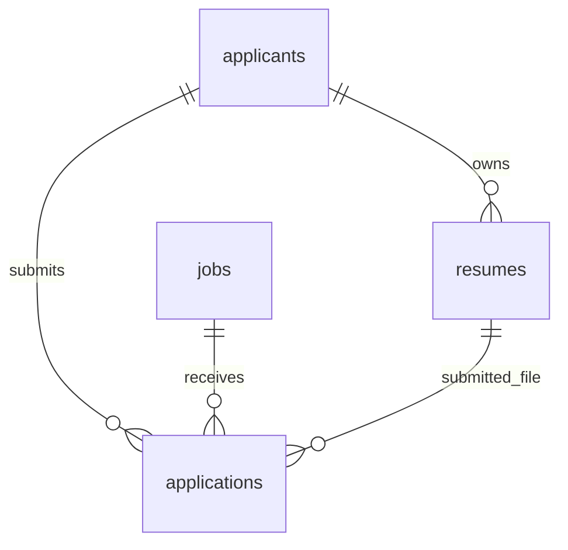
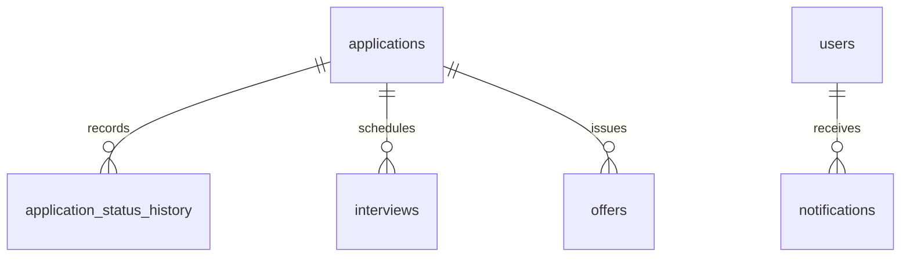

# Cơ sở dữ liệu Job Portal MVP

Phiên bản 1.0 • 14/09/2026 • PostgreSQL 16 • Thiết kế để triển khai, chưa phải migration đã chạy.

Tài liệu này và [USE_CASES.md](../business-analysis/USE_CASES.md) là đặc tả nghiệp vụ/CSDL hiện hành. Nếu khác SRS, flow hoặc kế hoạch MVP cũ, dùng hai tài liệu này. Các quyết định dưới đây là baseline thiết kế của MVP, không mô tả nội bộ TopCV.

## 1. Phạm vi và quyết định

| Nội dung | Quyết định MVP |
|---|---|
| Vai trò | Một tài khoản có một role: APPLICANT, RECRUITER, ADMIN. Admin không đăng ký công khai. |
| Doanh nghiệp | Một recruiter thuộc tối đa một công ty đang tham gia; một công ty có nhiều recruiter, đúng một OWNER hoạt động. |
| Công ty | Duyệt hồ sơ thủ công; tách kết quả duyệt khỏi đình chỉ hoạt động. Không tự nhận quyền qua tên công ty/email domain. |
| Job | Một nhóm nghề, một địa điểm chính, nhiều kỹ năng; VND/tháng; có lương thỏa thuận. |
| CV | Upload PDF/DOC/DOCX hoặc tạo PDF từ một mẫu cố định. File đã tạo bất biến. |
| Ứng tuyển | Một application/applicant/job trong toàn bộ lịch sử, kể cả rút hoặc bị từ chối. |
| Pipeline | Cho phép bỏ screening riêng; bảng chuyển trạng thái ở mục 5 là danh sách cho phép duy nhất. |
| Offer | Nhiều lần phát hành nối tiếp; tối đa một DRAFT/SENT và một ACCEPTED/application. Accepted chưa tự thành Hired. |
| AI | Matching theo quy tắc; LLM giải thích matching và soạn JD. Không tự ra quyết định tuyển dụng. |
| Kênh thông báo | In-app bền vững trong DB; email có hàng đợi DB và retry đơn giản. |
| Ngoài phạm vi | Thanh toán, kho CV công khai, chat, CV editor kéo thả, phân quyền tùy biến, microservices. |

## 2. Sơ đồ quan hệ rút gọn

Chia theo nhóm để tránh đường nối chồng chéo. Bảng nối và khóa ngoại được mô tả đầy đủ trong từ điển dữ liệu.

## 3. Quy ước dữ liệu

- PK mặc định: `id uuid`, sinh phía server. Bảng nối ghi rõ khóa ghép.
- Các bảng có PK id mặc định có `created_at timestamptz NOT NULL DEFAULT now()`. Bảng mutable có thêm `updated_at`; bảng append-only không có updated_at.
- Mọi cột trong bảng dưới là NOT NULL trừ khi có dấu `?`. Cột ? cho phép NULL. Giá trị mặc định được ghi trong mô tả; các giá trị còn lại phải được cung cấp.
- `FK → bảng.cột` mặc định ON DELETE RESTRICT. Không cascade xóa nghiệp vụ.
- Email: trim + lowercase trước lưu, unique trên giá trị chuẩn hóa. Không tự sửa dấu chấm hoặc dấu cộng.
- Thời gian lưu UTC, API dùng ISO 8601 có offset; giao diện chuyển múi giờ. Deadline là thời điểm chính xác, hết hạn khi now >= deadline.
- Tiền dùng numeric(14,2), không dùng float. Mã trạng thái dùng varchar + CHECK, không dùng PostgreSQL ENUM để dễ migration.
- Trường văn bản có giới hạn độ dài phía API. Nội dung JD/cover letter/feedback là plain text; không nhận HTML tùy ý.
- JSONB chỉ dùng cho dữ liệu snapshot/template/output AI có schema validation; không thay các quan hệ chính bằng JSON.
- Token bí mật chỉ lưu SHA-256 digest của token ngẫu nhiên đủ mạnh; mật khẩu dùng Argon2id. Không lưu token thô trong DB/log.
- Audit/history append-only với quyền DB phù hợp. Không áp dụng soft-delete đại trà: catalog ngừng sử dụng, nghiệp vụ kết thúc trạng thái, file có deleted_at.

## 4. Từ điển 29 bảng

### 4.1. users — tài khoản

| Cột | Kiểu | Ý nghĩa/ràng buộc |
|---|---|---|
| id | uuid PK | Tài khoản |
| email | varchar(254) UNIQUE | Email chuẩn hóa |
| password_hash | text | Argon2id |
| role | varchar(16) | APPLICANT / RECRUITER / ADMIN |
| full_name | varchar(150) | Tên hiện tại |
| phone | varchar(32)? | Liên hệ |
| status | varchar(16) | ACTIVE / SUSPENDED / DEACTIVATED; mặc định ACTIVE |
| email_verified_at | timestamptz? | NULL khi chưa xác thực |
| suspended_reason | text? | Bắt buộc khi SUSPENDED |
| last_login_at | timestamptz? | Đăng nhập gần nhất |

Mutable. Không có API đổi role trong MVP. Quyền nhạy cảm kiểm tra trạng thái tài khoản hiện tại, không chỉ claim JWT cũ.

### 4.2. auth_sessions — phiên đăng nhập

| Cột | Kiểu | Ý nghĩa/ràng buộc |
|---|---|---|
| id | uuid PK | session_id trong access token |
| user_id | uuid FK → users.id | Chủ phiên |
| refresh_token_hash | char(64) UNIQUE | Digest token hiện tại |
| expires_at | timestamptz | Hết hạn tuyệt đối |
| revoked_at | timestamptz? | Thu hồi |
| last_used_at | timestamptz? | Refresh gần nhất |

Mutable. Refresh xoay token trong transaction. Logout/đổi mật khẩu/khóa user thu hồi phiên theo use case. Access token ngắn hạn; API kiểm tra phiên chưa thu hồi.

### 4.3. account_tokens — xác thực email/đặt lại mật khẩu

| Cột | Kiểu | Ý nghĩa/ràng buộc |
|---|---|---|
| id | uuid PK | Token record |
| user_id | uuid FK → users.id | Chủ token |
| purpose | varchar(24) | VERIFY_EMAIL / RESET_PASSWORD |
| token_hash | char(64) UNIQUE | Digest |
| expires_at | timestamptz | Hạn sử dụng |
| consumed_at | timestamptz? | Dùng một lần |

Mutable. Phát token mới vô hiệu token cũ cùng purpose bằng consumed_at. Khóa bản ghi khi sử dụng.

### 4.4. companies — công ty

| Cột | Kiểu | Ý nghĩa/ràng buộc |
|---|---|---|
| id | uuid PK | Công ty |
| name | varchar(200) | Tên doanh nghiệp |
| registration_number | varchar(32) UNIQUE | Mã đăng ký/mã số thuế; chuẩn hóa khoảng trắng |
| description | text | Giới thiệu |
| industry | varchar(120) | Lĩnh vực công ty, không phải nhóm nghề của job |
| size_band | varchar(16) | 1_10 / 11_50 / 51_200 / 201_500 / 501_1000 / ABOVE_1000 |
| website_url | varchar(2048)? | Chỉ HTTP(S), không fetch từ backend |
| logo_key | text? | Khóa ảnh đã kiểm tra; không chứa đường dẫn do client chọn |
| address | varchar(500) | Địa chỉ |
| location_id | uuid FK → locations.id | Tỉnh/thành |
| verification_status | varchar(16) | PENDING / VERIFIED / REJECTED |
| verification_note | text? | Bắt buộc khi REJECTED |
| reviewed_by | uuid? FK → users.id | Admin duyệt |
| reviewed_at | timestamptz? | Thời điểm duyệt |
| status | varchar(16) | ACTIVE / SUSPENDED |
| suspension_reason | text? | Bắt buộc khi SUSPENDED |
| created_by | uuid FK → users.id | Người khởi tạo |

Mutable. Hồ sơ mới PENDING/ACTIVE. Mã đăng ký duy nhất không chứng minh quyền sở hữu; admin duyệt thủ công theo checklist liên hệ/website/mã đăng ký. Đây là xét duyệt của nền tảng, không phải chứng nhận pháp lý. MVP khóa sửa name/registration_number sau VERIFIED; yêu cầu thay đổi qua admin ngoài luồng tự phục vụ.

### 4.5. company_memberships — thành viên tuyển dụng

| Cột | Kiểu | Ý nghĩa/ràng buộc |
|---|---|---|
| id | uuid PK | Membership |
| company_id | uuid FK → companies.id | Công ty |
| user_id | uuid FK → users.id | Phải là RECRUITER |
| membership_role | varchar(8) | OWNER / MEMBER |
| joined_at | timestamptz | Ngày tham gia |
| left_at | timestamptz? | NULL là còn tham gia |

Mutable. Unique partial(user_id) WHERE left_at IS NULL. Unique partial(company_id) WHERE membership_role='OWNER' AND left_at IS NULL. Tạo công ty và OWNER cùng transaction. Không cho xóa/chuyển OWNER trong MVP; admin không khóa OWNER cuối cùng khi còn vận hành công ty mà chưa đình chỉ công ty.

### 4.6. company_invitations — lời mời thành viên

| Cột | Kiểu | Ý nghĩa/ràng buộc |
|---|---|---|
| id | uuid PK | Lời mời |
| company_id | uuid FK → companies.id | Công ty |
| email | varchar(254) | Email nhận đã chuẩn hóa |
| invited_by | uuid FK → users.id | OWNER |
| token_hash | char(64) UNIQUE | Digest bí mật |
| status | varchar(16) | PENDING / ACCEPTED / REVOKED / EXPIRED |
| expires_at | timestamptz | 7 ngày kể từ tạo |
| accepted_by | uuid? FK → users.id | Người nhận |
| accepted_at | timestamptz? | Cùng có/không với accepted_by |

Mutable. Unique partial(company_id,email) WHERE status='PENDING'. Trước gửi lại, chuyển lời mời quá hạn sang EXPIRED trong transaction. Lời mời chỉ cấp MEMBER.

### 4.7. locations — danh mục tỉnh/thành

| Cột | Kiểu | Ý nghĩa/ràng buộc |
|---|---|---|
| id | uuid PK | ID ổn định |
| code | varchar(20) UNIQUE | Mã nguồn danh mục |
| name | varchar(150) | Tên hiển thị |
| is_active | boolean | Mặc định true |

Mutable. Seed theo một phiên bản danh mục có ngày nguồn; không xóa nơi đã được tham chiếu. Không xử lý ánh xạ lịch sử địa giới trong MVP.

### 4.8. job_categories — nhóm nghề

| Cột | Kiểu | Ý nghĩa/ràng buộc |
|---|---|---|
| id | uuid PK | Nhóm nghề |
| name | varchar(120) UNIQUE | Tên |
| is_active | boolean | Mặc định true |

Mutable. Danh mục phẳng, seed/admin quản lý; không phân cấp nhiều tầng.

### 4.9. skills — kỹ năng chuẩn hóa

| Cột | Kiểu | Ý nghĩa/ràng buộc |
|---|---|---|
| id | uuid PK | Kỹ năng |
| name | varchar(100) | Tên hiển thị |
| normalized_name | varchar(100) UNIQUE | Trim/lowercase; ví dụ python |
| is_active | boolean | Mặc định true |

Mutable. Không tự tạo skill từ text AI hoặc tag do client gửi.

### 4.10. applicants — hồ sơ ứng viên

| Cột | Kiểu | Ý nghĩa/ràng buộc |
|---|---|---|
| id | uuid PK | Hồ sơ |
| user_id | uuid UNIQUE FK → users.id | Phải là APPLICANT |
| headline | varchar(200)? | Chức danh mong muốn |
| summary | text? | Giới thiệu |
| location_id | uuid? FK → locations.id | Nơi sinh sống |
| preferred_location_id | uuid? FK → locations.id | Địa điểm muốn làm |
| years_experience | numeric(4,1)? | >= 0 |
| desired_salary_min | numeric(14,2)? | >= 0, VND/tháng |
| desired_salary_max | numeric(14,2)? | >= min nếu cả hai có giá trị |
| preferred_work_mode | varchar(8)? | ONSITE / HYBRID / REMOTE |
| preferred_employment_type | varchar(16)? | FULL_TIME / PART_TIME / INTERNSHIP / CONTRACT |

Mutable. Hồ sơ tạo cùng tài khoản; không bắt buộc điền hết để tìm việc. Thiếu dữ liệu matching được xử lý theo UC-29.

### 4.11. applicant_educations — học vấn

| Cột | Kiểu | Ý nghĩa/ràng buộc |
|---|---|---|
| id | uuid PK | Học vấn |
| applicant_id | uuid FK → applicants.id | Chủ |
| institution | varchar(200) | Trường |
| degree | varchar(100)? | Bằng cấp |
| field_of_study | varchar(150)? | Ngành |
| start_date | date | Bắt đầu |
| end_date | date? | NULL nếu đang học |
| description | text? | Bổ sung |

Mutable. end_date >= start_date; không khai báo ngày bắt đầu trong tương lai.

### 4.12. applicant_experiences — kinh nghiệm

| Cột | Kiểu | Ý nghĩa/ràng buộc |
|---|---|---|
| id | uuid PK | Kinh nghiệm |
| applicant_id | uuid FK → applicants.id | Chủ |
| company_name | varchar(200) | Tên tự khai, không FK companies |
| job_title | varchar(200) | Vị trí |
| start_date | date | Bắt đầu |
| end_date | date? | NULL nếu đang làm |
| description | text? | Công việc/kết quả |

Mutable. end_date >= start_date. Cho phép các giai đoạn chồng nhau để hỗ trợ làm song song.

### 4.13. applicant_skills — kỹ năng hồ sơ

| Cột | Kiểu | Ý nghĩa/ràng buộc |
|---|---|---|
| applicant_id | uuid FK → applicants.id | PK ghép |
| skill_id | uuid FK → skills.id | PK ghép |

Không có id/timestamp mặc định. PK(applicant_id,skill_id). Tối đa 50 skill/hồ sơ; xóa liên kết không xóa danh mục.

### 4.14. cv_documents — nội dung CV theo mẫu

| Cột | Kiểu | Ý nghĩa/ràng buộc |
|---|---|---|
| id | uuid PK | Bản soạn CV |
| applicant_id | uuid FK → applicants.id | Chủ |
| title | varchar(150) | Tên bản soạn |
| template_code | varchar(32) | MVP: BASIC_V1 |
| content | jsonb | Schema CV_V1 |
| revision | integer | >=1, tăng khi sửa |
| deleted_at | timestamptz? | Xóa mềm |

Mutable. content chứa contact{name,email,phone}, summary, education[], experience[], skills[], projects[]. Validate kiểu/độ dài; không nhận HTML, script, URL tải ảnh/font. Khởi tạo có thể sao chép hồ sơ; sửa CV không sửa ngược hồ sơ.

### 4.15. resumes — file CV bất biến

| Cột | Kiểu | Ý nghĩa/ràng buộc |
|---|---|---|
| id | uuid PK | File |
| applicant_id | uuid FK → applicants.id | Chủ |
| source | varchar(16) | UPLOAD / GENERATED |
| cv_document_id | uuid? FK → cv_documents.id | Bắt buộc khi GENERATED |
| document_revision | integer? | Revision lúc xuất |
| title | varchar(150) | Tên hiển thị, được sửa |
| storage_key | text UNIQUE | Khóa file private |
| original_name | varchar(255) | Tên tải xuống đã làm sạch |
| mime_type | varchar(100) | Allowlist |
| size_bytes | bigint | >0 và <=5 MiB |
| sha256 | char(64) | Kiểm tra tính toàn vẹn, không unique toàn hệ thống |
| is_default | boolean | Mặc định false |
| deleted_at | timestamptz? | Ẩn khỏi danh sách chọn |

Mutable chỉ title/is_default/deleted_at. File và source metadata bất biến. CHECK source/generated fields nhất quán. Unique partial(applicant_id) WHERE is_default AND deleted_at IS NULL; CHECK deleted_at IS NULL OR NOT is_default. CV ẩn nhưng đã nộp vẫn tải được qua quyền application trong thời hạn lưu dữ liệu.

### 4.16. jobs — tin tuyển dụng

| Cột | Kiểu | Ý nghĩa/ràng buộc |
|---|---|---|
| id | uuid PK | Job |
| company_id | uuid FK → companies.id | Công ty |
| created_by | uuid FK → users.id | Recruiter tạo |
| title | varchar(200) | Tiêu đề |
| description | text? | Mô tả |
| requirements | text? | Yêu cầu |
| benefits | text? | Quyền lợi |
| category_id | uuid? FK → job_categories.id | Nhóm nghề |
| location_id | uuid? FK → locations.id | Địa điểm chính |
| address | varchar(500)? | Địa chỉ |
| employment_type | varchar(16)? | Như applicants |
| work_mode | varchar(8)? | Như applicants |
| seniority | varchar(16)? | INTERN / JUNIOR / MIDDLE / SENIOR / LEAD / MANAGER |
| experience_min_years | numeric(4,1)? | >=0 |
| vacancy_count | integer? | >0; số lượng dự kiến, không tự đóng khi đủ |
| salary_min | numeric(14,2)? | >=0 |
| salary_max | numeric(14,2)? | >= min |
| is_negotiable | boolean | Mặc định true |
| currency | char(3) | CHECK='VND', mặc định VND |
| salary_period | varchar(8) | CHECK='MONTH', mặc định MONTH |
| deadline | timestamptz? | Bắt buộc khi submit |
| status | varchar(24) | DRAFT / PENDING_APPROVAL / REJECTED / PUBLISHED / CLOSED |
| published_at | timestamptz? | Lần duyệt thành công |
| closed_at | timestamptz? | Đóng |
| closure_reason | text? | Lý do |
| version | integer | >=1; chống ghi đè khi sửa/chuyển trạng thái |

Mutable có kiểm soát. Draft cho phép thiếu trường. Khi submit bắt buộc description/requirements/benefits/category/employment/work_mode/seniority/experience/vacancy/deadline; onsite/hybrid cần location/address. Nếu negotiable=true thì hai salary NULL; ngược lại cả hai bắt buộc, max>=min. Áp CHECK lương và số không âm cả ở draft; required theo trạng thái được validation/constraint tương ứng. PUBLISHED không sửa nội dung, chỉ đóng; sao chép tạo job DRAFT mới.

### 4.17. job_skills — yêu cầu kỹ năng

| Cột | Kiểu | Ý nghĩa/ràng buộc |
|---|---|---|
| job_id | uuid FK → jobs.id | PK ghép |
| skill_id | uuid FK → skills.id | PK ghép |

PK(job_id,skill_id), không id/timestamp. Submit yêu cầu 1–30 skill active. Là tiêu chí matching, không phải cổng tự loại ứng viên.

### 4.18. job_status_history — lịch sử tin

| Cột | Kiểu | Ý nghĩa/ràng buộc |
|---|---|---|
| id | uuid PK | Sự kiện |
| job_id | uuid FK → jobs.id | Job |
| from_status | varchar(24)? | NULL lần tạo |
| to_status | varchar(24) | Trạng thái đích |
| changed_by | uuid? FK → users.id | NULL nếu system |
| reason | text? | Bắt buộc reject/close |
| actor_type | varchar(8) | USER / SYSTEM |

Append-only. created_at là thời điểm đổi. Đồng transaction với jobs; lưu từ NULL đến DRAFT khi tạo.

### 4.19. applications — đơn ứng tuyển

| Cột | Kiểu | Ý nghĩa/ràng buộc |
|---|---|---|
| id | uuid PK | Đơn |
| job_id | uuid FK → jobs.id | Job |
| applicant_id | uuid FK → applicants.id | Người nộp |
| resume_id | uuid FK → resumes.id | File đã chọn |
| contact_name | varchar(150) | Snapshot khi nộp |
| contact_email | varchar(254) | Snapshot, từ email tài khoản đã xác thực |
| contact_phone | varchar(32) | Snapshot |
| cover_letter | text? | <=3000 ký tự |
| status | varchar(16) | APPLIED / SCREENING / INTERVIEW / OFFER / HIRED / REJECTED / WITHDRAWN |
| version | integer | >=1 |
| ended_at | timestamptz? | Có khi HIRED/REJECTED/WITHDRAWN |

Mutable chỉ trạng thái/version/ended_at. created_at là applied_at, không nhân đôi. UNIQUE(applicant_id,job_id). UNIQUE(resumes.id,applicant_id) trên resumes và composite FK applications(resume_id,applicant_id) → resumes(id,applicant_id) để chặn CV khác chủ ở DB. Snapshot chỉ bất biến đến khi có quy trình xóa/ẩn danh dữ liệu hợp lệ.

### 4.20. application_status_history — lịch sử đơn

| Cột | Kiểu | Ý nghĩa/ràng buộc |
|---|---|---|
| id | uuid PK | Sự kiện |
| application_id | uuid FK → applications.id | Đơn |
| from_status | varchar(16)? | NULL lúc nộp |
| to_status | varchar(16) | Đích |
| changed_by | uuid? FK → users.id | Người thực hiện |
| actor_type | varchar(8) | USER / SYSTEM |
| reason | text? | Bắt buộc reject, withdraw, quay lại interview |

Append-only. Không lưu feedback nội bộ vào reason công khai. Applicant xem lịch sử công khai qua DTO riêng.

### 4.21. application_notes — ghi chú nội bộ

| Cột | Kiểu | Ý nghĩa/ràng buộc |
|---|---|---|
| id | uuid PK | Ghi chú |
| application_id | uuid FK → applications.id | Đơn |
| author_id | uuid FK → users.id | Recruiter cùng công ty |
| content | text | 1–3000 ký tự |

Append-only trong MVP; sửa sai bằng ghi chú tiếp theo. Không trả applicant hoặc public.

### 4.22. interviews — các vòng phỏng vấn

| Cột | Kiểu | Ý nghĩa/ràng buộc |
|---|---|---|
| id | uuid PK | Vòng |
| application_id | uuid FK → applications.id | Đơn |
| round_number | integer | >0; UNIQUE(application_id,round_number) |
| starts_at | timestamptz | Bắt đầu |
| ends_at | timestamptz | > starts_at |
| mode | varchar(8) | ONLINE / OFFLINE |
| meeting_url | varchar(2048)? | HTTP(S), bắt buộc online |
| address | varchar(500)? | Bắt buộc offline |
| interviewer_name | varchar(150) | Không cần module lịch nhân sự |
| status | varchar(16) | SCHEDULED / COMPLETED / CANCELLED / NO_SHOW |
| result | varchar(16)? | PASS / FAIL / UNDECIDED; chỉ khi COMPLETED |
| feedback | text? | Nội bộ <=5000 ký tự |
| cancellation_reason | text? | Bắt buộc CANCELLED |
| created_by | uuid FK → users.id | Recruiter |
| version | integer | >=1 |

Mutable. Không tái sử dụng số vòng bị hủy. MVP chặn trùng lịch SCHEDULED của cùng application; không quản lý lịch interviewer giữa các công ty. Khóa application khi kiểm tra khoảng giờ giao nhau.

### 4.23. offers — các lần phát hành offer

| Cột | Kiểu | Ý nghĩa/ràng buộc |
|---|---|---|
| id | uuid PK | Offer |
| application_id | uuid FK → applications.id | Đơn |
| sequence_number | integer | >0; UNIQUE(application_id,sequence_number) |
| salary | numeric(14,2) | >0, VND/tháng, gross |
| currency | char(3) | CHECK='VND' |
| start_date | date | Ngày bắt đầu dự kiến |
| response_deadline | timestamptz | Hạn phản hồi |
| terms | text | Điều kiện 1–10000 ký tự |
| status | varchar(16) | DRAFT / SENT / ACCEPTED / REJECTED / WITHDRAWN / EXPIRED |
| created_by | uuid FK → users.id | Recruiter |
| sent_at | timestamptz? | Có từ lúc gửi |
| responded_at | timestamptz? | Có khi ACCEPTED/REJECTED |
| response_note | text? | Applicant nhập, <=1000 |
| withdrawn_at | timestamptz? | Có khi WITHDRAWN |
| withdrawal_reason | text? | Bắt buộc WITHDRAWN |
| version | integer | >=1 |

Mutable theo state. Unique partial(application_id) WHERE status IN ('DRAFT','SENT'); unique partial(application_id) WHERE status='ACCEPTED'. Sau SENT, không sửa salary/terms/deadline/start_date. Muốn thương lượng lại: thu hồi hoặc đợi kết quả, application trở về INTERVIEW, tạo offer mới. Offer ACCEPTED giữ nguyên khi application bị rút/từ chối sau đó, để bảo toàn sự kiện chấp nhận.

### 4.24. notifications — thông báo trong ứng dụng

| Cột | Kiểu | Ý nghĩa/ràng buộc |
|---|---|---|
| id | uuid PK | Thông báo |
| user_id | uuid FK → users.id | Người nhận |
| event_key | varchar(200) | Khóa sự kiện xác định |
| type | varchar(64) | Mã sự kiện |
| title | varchar(200) | Tiêu đề |
| body | text | Thông điệp không chứa CV/token/feedback nội bộ |
| resource_type | varchar(32)? | JOB / APPLICATION / INTERVIEW / OFFER / COMPANY |
| resource_id | uuid? | Tham chiếu điều hướng, không FK đa hình |
| read_at | timestamptz? | Chưa đọc nếu NULL |

Mutable read_at. UNIQUE(user_id,event_key). Bấm liên kết vẫn kiểm tra quyền ở API tài nguyên.

### 4.25. email_deliveries — hàng đợi email

| Cột | Kiểu | Ý nghĩa/ràng buộc |
|---|---|---|
| id | uuid PK | Delivery |
| user_id | uuid? FK → users.id | NULL nếu mời email chưa có tài khoản |
| notification_id | uuid? FK → notifications.id | Nếu phát từ in-app |
| dedup_key | varchar(200) UNIQUE | Chống tạo tác vụ trùng |
| recipient | varchar(254) | Người nhận |
| template_code | varchar(64) | Template cho phép |
| payload_ciphertext | bytea | Payload mã hóa ứng dụng, gồm link token nếu cần |
| status | varchar(16) | PENDING / PROCESSING / SENT / FAILED |
| attempts | integer | >=0, mặc định 0 |
| next_attempt_at | timestamptz | Lịch retry |
| locked_until | timestamptz? | Lease để phục hồi worker chết |
| sent_at | timestamptz? | Hoàn thành |
| last_error_code | varchar(64)? | Mã lỗi an toàn, không raw response chứa bí mật |

Mutable. Khóa mã hóa nằm ngoài DB; payload bị xóa hoặc thay bằng payload rỗng mã hóa sau gửi/hết hạn retention. Worker dùng FOR UPDATE SKIP LOCKED, lease 2 phút; tối đa 5 lần, backoff 1/5/15/60 phút. Email là at-least-once, có thể trùng khi SMTP thành công nhưng worker chết trước commit; in-app không trùng.

### 4.26. audit_logs — sự kiện nhạy cảm

| Cột | Kiểu | Ý nghĩa/ràng buộc |
|---|---|---|
| id | uuid PK | Sự kiện |
| actor_id | uuid? FK → users.id | NULL nếu system |
| action | varchar(64) | COMPANY_REVIEW, JOB_APPROVE, CV_DOWNLOAD_AUTHORIZED… |
| entity_type | varchar(32) | Loại đối tượng |
| entity_id | uuid? | Tham chiếu, không FK đa hình |
| request_id | uuid | Liên kết request |
| outcome | varchar(16) | SUCCESS / DENIED / FAILURE |
| metadata | jsonb | Allowlist: status cũ/mới, reason_code; không CV/token/prompt |

Append-only. CV_DOWNLOAD_AUTHORIZED ghi trước cấp stream; không khẳng định client nhận xong file. Log từ chối ngoài transaction bị rollback của nghiệp vụ.

### 4.27. ai_operations — cache và theo dõi AI

| Cột | Kiểu | Ý nghĩa/ràng buộc |
|---|---|---|
| id | uuid PK | Lần gọi |
| requested_by | uuid FK → users.id | Người dùng |
| feature | varchar(24) | MATCH_EXPLANATION / JD_DRAFT |
| applicant_id | uuid? FK → applicants.id | Matching |
| job_id | uuid? FK → jobs.id | Matching hoặc job nháp |
| input_hash | char(64) | Hash input đã tối thiểu hóa, có prompt/scoring version |
| provider | varchar(32) | Nhà cung cấp |
| model | varchar(100) | Model thực dùng |
| prompt_version | varchar(32) | Phiên bản |
| status | varchar(16) | SUCCEEDED / FAILED |
| output | jsonb? | Kết quả đã validate, tối thiểu dữ liệu cá nhân |
| error_code | varchar(64)? | Lỗi an toàn |
| input_tokens | integer? | >=0 |
| output_tokens | integer? | >=0 |
| expires_at | timestamptz | TTL cache mặc định 24h |

Append-only. Không lưu prompt thô/API key. Cache lookup theo requested_by,feature,input_hash,model,prompt_version và SUCCEEDED chưa hết hạn; không chia sẻ output riêng tư giữa user. Feature matching bắt buộc applicant/job; JD_DRAFT có thể chưa có job_id. Input hash dùng nội dung canonical, không chỉ ID.

### 4.28. ai_rate_windows — giới hạn AI dùng chung

| Cột | Kiểu | Ý nghĩa/ràng buộc |
|---|---|---|
| user_id | uuid FK → users.id | PK ghép |
| feature | varchar(24) | PK ghép |
| window_start | timestamptz | PK ghép, đầu ngày UTC |
| request_count | integer | >=0 |
| reserved_tokens | integer | >=0 |

Không id/timestamp. Tăng atomically trước gọi provider, giới hạn cấu hình mặc định 20 lần/user/feature/ngày; cache hit không tính. Giới hạn concurrency/timeout ở dịch vụ. Xóa window cũ sau 7 ngày.

### 4.29. security_rate_windows — giới hạn endpoint nhạy cảm

| Cột | Kiểu | Ý nghĩa/ràng buộc |
|---|---|---|
| scope | varchar(32) | PK ghép: LOGIN / REGISTER / RESET / VERIFY_RESEND |
| subject_hash | char(64) | PK ghép; HMAC IP/email chuẩn hóa, secret ngoài DB |
| window_start | timestamptz | PK ghép, cửa sổ 15 phút |
| request_count | integer | >=0 |

Không id/timestamp. Rate limit theo IP và theo email ở LOGIN/RESET, IP ở REGISTER, user và IP ở resend. Tăng atomically; ngưỡng cấu hình, mặc định login 10/email và 100/IP/15 phút, reset/resend 5/15 phút. Xóa sau 24h. Không khóa vĩnh viễn tài khoản do attacker thử sai.

## 5. Chuyển trạng thái chuẩn

### Job

| Từ | Sang | Điều kiện/hành động |
|---|---|---|
| Mới | DRAFT | Recruiter là member hợp lệ |
| DRAFT / REJECTED | PENDING_APPROVAL | Đủ dữ liệu, company VERIFIED/ACTIVE, email đã xác thực |
| PENDING_APPROVAL | DRAFT | Recruiter thu hồi để sửa |
| PENDING_APPROVAL | PUBLISHED | Admin duyệt, kiểm tra lại deadline/company |
| PENDING_APPROVAL | REJECTED | Admin có lý do |
| PUBLISHED | CLOSED | Recruiter/admin đóng có lý do hoặc system hết hạn |

Published hợp lệ để apply khi company VERIFIED/ACTIVE, deadline > now, job.status=PUBLISHED. Luôn kiểm tra điều kiện này kể cả worker chưa đóng job. Đóng tin không kết thúc application cũ.

### Application

| Từ | Sang | Tác nhân/điều kiện |
|---|---|---|
| Mới | APPLIED | Applicant nộp thành công |
| APPLIED | SCREENING | Recruiter |
| APPLIED / SCREENING / INTERVIEW | INTERVIEW | Tạo lịch; nếu đã INTERVIEW không thêm history cùng trạng thái |
| INTERVIEW | OFFER | Gửi offer, đã có ít nhất một interview COMPLETED; không còn SCHEDULED |
| OFFER | INTERVIEW | Offer bị reject/expired/withdrawn; ghi reason, cho phép thương lượng lại |
| OFFER | HIRED | Recruiter xác nhận; có offer ACCEPTED |
| APPLIED / SCREENING / INTERVIEW / OFFER | REJECTED | Recruiter, reason công khai bắt buộc |
| APPLIED / SCREENING / INTERVIEW / OFFER | WITHDRAWN | Applicant, reason ngắn bắt buộc |

HIRED/REJECTED/WITHDRAWN là cuối; không mở lại. Khi kết thúc reject/withdraw, hủy SCHEDULED interviews, thu hồi DRAFT/SENT offers cùng transaction. ACCEPTED offer giữ nguyên lịch sử, không tự đưa về INTERVIEW.

### Interview và offer

| Đối tượng | Chuyển hợp lệ |
|---|---|
| Interview | SCHEDULED → COMPLETED / CANCELLED / NO_SHOW; đổi lịch giữ SCHEDULED và ghi audit/notification |
| Offer | DRAFT → SENT / WITHDRAWN; SENT → ACCEPTED / REJECTED / WITHDRAWN / EXPIRED |
| Offer đã kết thúc | Bất biến; bản mới tăng sequence_number |
| Interview hoàn tất | Không sửa trong MVP; bổ sung giải trình bằng note |

COMPLETED chỉ khi đã tới starts_at; NO_SHOW chỉ khi đã qua ends_at. Offer chấp nhận đúng deadline không hợp lệ (now >= deadline). Worker và user cùng khóa application rồi offer để không xử lý hai kết quả.

## 6. Index và transaction bắt buộc

| Nhóm | Index/constraint |
|---|---|
| Public search | jobs(status,deadline,created_at DESC,id), jobs(company_id,status), jobs(category_id,location_id); GIN to_tsvector('simple',title + description + requirements) |
| Company | memberships(company_id,left_at), các unique partial ở 4.5; không FK recruiter trực tiếp vào jobs thay company |
| Matching | job_skills(skill_id,job_id), applicant_skills(skill_id,applicant_id) |
| Application | applications(job_id,status,created_at DESC,id), applications(applicant_id,created_at DESC,id), unique cặp applicant/job |
| History | job_status_history(job_id,created_at,id), application_status_history(application_id,created_at,id) |
| Interview/offer | interviews(application_id,status,starts_at), offers(application_id,status), offers(status,response_deadline) |
| Thông báo/worker | notifications(user_id,created_at DESC,id), index partial unread; email_deliveries(status,next_attempt_at), index lease PROCESSING |
| Audit/AI | audit_logs(created_at DESC,id), audit_logs(entity_type,entity_id,created_at); ai_operations(requested_by,feature,input_hash,expires_at) |
| Token | index token hash unique; auth_sessions(user_id,revoked_at); account_tokens(user_id,purpose) |

Tất cả FK thường dùng tra cứu cần index; unique/index ghép đã có tiền tố tương ứng không tạo thêm index trùng.

| Thao tác | Phạm vi atomic |
|---|---|
| Đăng ký | User + applicant (nếu có) + token + email delivery |
| Tạo công ty | Company + OWNER; khóa user chống tạo đồng thời |
| Nhận lời mời | Khóa user/company/invitation; membership + accepted + audit |
| Duyệt/đóng job | Job + history + notifications + email deliveries + audit |
| Apply | Khóa company/job/resume, kiểm tra lại deadline/owner; application + history + notifications |
| Pipeline/interview/offer | Khóa company → application → interview/offer; state + history + notifications + audit |
| CV default/delete | Khóa applicant → resume; bỏ default cũ trước đặt mới |
| Suspension | Khóa company/user tương ứng; trạng thái + thu hồi session + audit; các request ghi kiểm tra lại cùng lock |

Thống nhất thứ tự khóa: user khi cần membership → company → job → applicant khi quản lý CV → application → resume/interview/offer. Use case chỉ khóa những bản ghi cần thiết; không khóa ngược thứ tự. Vi phạm unique/state → HTTP 409; kiểm tra trước trong code không thay thế constraint. expected_version không khớp → 409, client tải lại.

Không giữ transaction khi gọi SMTP, LLM hoặc render PDF. Render/upload file trước, insert metadata sau khi thành công; DB lỗi thì xóa file vừa tạo hoặc đánh dấu cleanup. File mồ côi được quét theo storage_key sau 24 giờ.

## 7. Chính sách dữ liệu và vận hành

| Nội dung | Chính sách MVP |
|---|---|
| Xóa CV | Ẩn ngay khỏi lựa chọn; giữ file đang được application tham chiếu trong thời hạn lưu; không ghi đè. |
| Xóa học vấn/skill | Cho sửa/xóa hồ sơ sống; PDF đã nộp không thay đổi. |
| Xóa job/company/user | Tự phục vụ dùng đóng/đình chỉ/deactivate; không cascade. Yêu cầu xóa dữ liệu cá nhân xử lý thủ công có audit. |
| Retention đề xuất | Hồ sơ đã kết thúc: 12 tháng từ ended_at; sau đó xử lý file/snapshot theo policy được công bố. Đây là lựa chọn sản phẩm cần rà trước dùng dữ liệu thật, không phải thời hạn pháp luật mặc định. |
| Giữ lịch sử | Khi cần xóa PII, xóa file và ẩn danh snapshot/note/output AI liên quan; giữ ID và dữ kiện tổng hợp tối thiểu nếu còn cơ sở lưu giữ. Quy trình có backup expiry rõ. |
| Email/AI | Payload email 7 ngày sau hoàn thành; output AI tối đa 30 ngày, cache 24h; token hết hạn dọn sau 7 ngày. |
| Audit | 12 tháng theo policy demo; không chứa CV, password, token, prompt thô. |
| Backup | Backup PostgreSQL và private files cùng kế hoạch; thử khôi phục trước bàn giao. |
| Danh mục | Seed versioned; không tự thêm skill từ AI; deactivate thay xóa bản ghi đang dùng. |

## 8. Điều kiện để chuyển sang migration

- Mỗi bảng có PK, NULL/default rõ; tạo bảng cha trước bảng con.
- Mọi FK/unique/CHECK/partial index trên đây được thể hiện trong migration.
- Điều kiện liên bảng/role/state đặt ở service transaction; không viết CHECK truy vấn bảng khác.
- Kiểm thử đồng thời: apply trùng, nhận hai lời mời, hai default CV, accept và expire offer, đổi trạng thái từ version cũ.
- Kiểm thử quyền: CV khác chủ, recruiter công ty khác, membership hết hiệu lực, session đã thu hồi.
- Hai tài liệu được cập nhật cùng nhau khi thay đổi nghiệp vụ. Không dùng số lượng bảng làm thước đo hoàn chỉnh.
